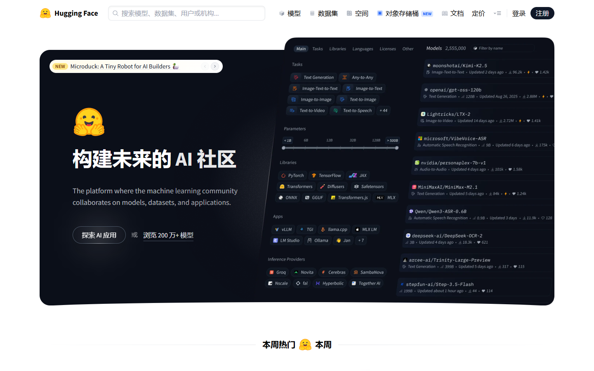
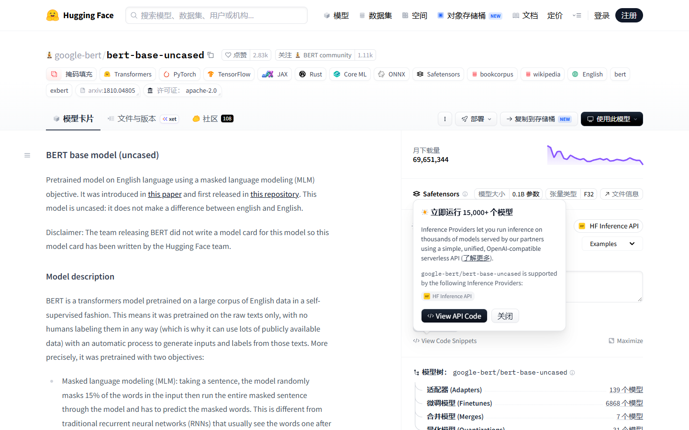
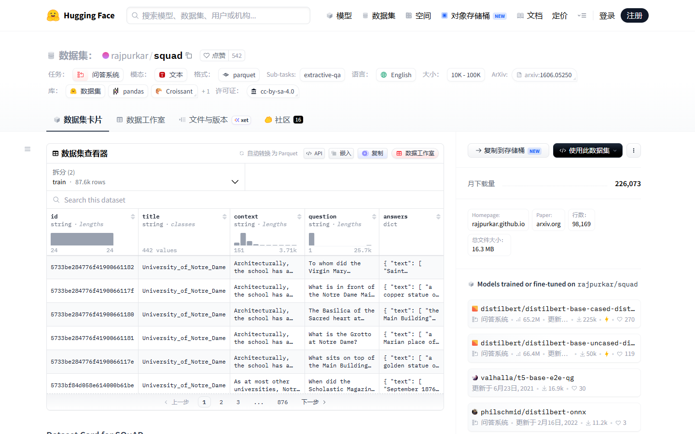

# Hugging Face 中文化增强版 🤗

<p align="center">
  <strong>现代化 Hugging Face 全站中文化油猴脚本：全站界面汉化 + 动态时间/正则解析 + 官方站与镜像站无缝支持 + 词库自动同步</strong>
</p>

<p align="center">
  <a href="https://raw.githubusercontent.com/3304711297/huggingface-chinese-plus/main/huggingface-chinese-plus.user.js"></a>
  <a href="https://github.com/3304711297/huggingface-chinese-plus/actions/workflows/ci.yml"></a>
  <a href="https://github.com/3304711297/huggingface-chinese-plus/actions/workflows/sync-upstream.yml"></a>
  
  <a href="https://www.gnu.org/licenses/gpl-3.0"></a>
</p>

> **English Summary**: A modern, high-performance userscript for complete Chinese localization of Hugging Face (`huggingface.co` & `hf-mirror.com`). Features dynamic text translation, zero interference with code blocks/model cards, and automated upstream dictionary synchronization every 6 hours.

---

## 📸 实机效果预览

| 首页导航 (HF Home) | 模型详情页 (Models) | 数据集详情页 (Datasets) |
| :---: | :---: | :---: |
|  |  |  |

> 经真实环境验证：全站导航栏、筛选器、状态标签、按钮与元数据面板 100% 汉化；**代码块、终端指令、Monaco 编辑器与 Model Card 正文严格处于安全区，绝不误伤**。

---

## 🚀 一键安装

1. 浏览器需已安装用户脚本管理器（[ScriptCat 脚本猫](https://scriptcat.org/) / Tampermonkey / Violentmonkey 均可）；
2. 点击下方链接直接安装：

| 安装通道 | 链接 | 说明 |
| :--- | :--- | :--- |
| ⚡ **GitHub 直连通道** | [一键安装 huggingface-chinese-plus.user.js](https://raw.githubusercontent.com/3304711297/huggingface-chinese-plus/main/huggingface-chinese-plus.user.js) | **推荐**。版本发布即刻生效 |
| 🌐 **jsDelivr 镜像通道** | [一键安装 (jsDelivr CDN 镜像)](https://cdn.jsdelivr.net/gh/3304711297/huggingface-chinese-plus@main/huggingface-chinese-plus.user.js) | 国内加速镜像（约有 12 小时 CDN 缓存） |

---

## ✨ 核心特性

- **1800+ 静态词条 + 130+ 动态正则**：静态词典秒级查表匹配，动态时效文本（如 `Updated 3 hours ago`、`1.2k downloads`）走高性能正则清洗替换。
- **极致性能与流畅度**：`TreeWalker` 高效 DOM 遍历 + `MutationObserver` 增量收集 + `requestIdleCallback` 空闲批处理调度，保证页面滚动与点击 0 掉帧。
- **严格的代码安全区保护**：代码高亮区、复制块、Monaco / CodeMirror 编辑器、Markdown 结构体绝不翻译，保证代码原样复制。
- **全属性中文化**：深度覆盖 `placeholder`、`title`、`aria-label` 等 HTML 属性，鼠标悬停与无障碍提示全汉化。
- **开发者攒词模式**：菜单支持一键开启「收集未命中词条」，自动去重并格式化导出 JSON，方便提交 Issue 持续补充词库。
- **上游词库自动跟进**：GitHub Actions 每 6 小时检测上游词库更新，多源 CDN 容灾自动发版，上游失效亦不影响正常使用。

---

## 🌐 站点与域名匹配范围

- **完整支持**：`huggingface.co`（含子域名）以及国内镜像站 `hf-mirror.com`。
- **排除 `*.hf.space`**：第三方用户自主托管的 Gradio / Streamlit Space 属于独立 Web 应用，故意予以排除以防止破坏用户应用的自定义文本。

---

## 🛠️ 本地开发与测试

```bash
# 1. 运行核心算法与上游检查单测
node --test tests/i18n-core.test.mjs tests/check-upstream.test.mjs

# 2. 手动执行上游词库同步检测
node scripts/check-upstream.mjs

# 3. 构建并输出单文件产物
node build.mjs
node --check huggingface-chinese-plus.user.js
```

### 版本号规范
采用 `<功能主版本>.<同步构建号>`（例如 `v1.3.1`）：
- **前两位变化**：核心引擎重构、算法优化或兼容性修复；
- **末位变化**：上游词库自动定时同步触发的增量构建。

---

## 📄 致谢与开源协议

- 词库源自 [izhadu/GreasyFork · HuggingFace-Chinese](https://github.com/izhadu/GreasyFork/tree/main/HuggingFace-Chinese)（GPL-3.0）；
- 翻译引擎为原创独立实现，参考了 [1cyberlangke1/huggingface-zh](https://github.com/1cyberlangke1/huggingface-zh)（MIT）。

本项目依据 **GNU General Public License v3.0 (GPL-3.0)** 开源。
